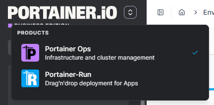
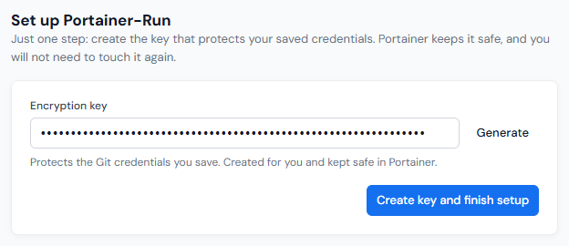
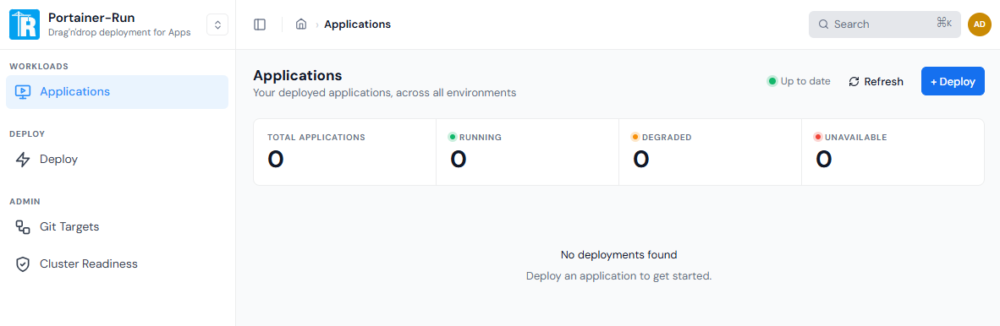

# Quick Start

Portainer-Run can be installed on a fresh server along with Portainer Business using the terminal installer. The following command will download the install script and run it on your server.


Ensure you meet the [requirements](requirements.md) before running the script.


```
curl -sfL https://get.portainer.run/get.sh | sudo sh -
```

Follow the steps in the installer to complete the setup. You will be asked to make some decisions along the way - we'll outline those below.


Portainer-Run can also be installed as an add-on within an existing Portainer Business installation on Kubernetes. You can learn more about this approach [in the Portainer documentation](https://docs.portainer.io/admin/add-ons).




### Domain

You will first be asked for the domain you want to use for applications deployed in Portainer-Run. Deployed applications will be given a subdomain of this domain - for example, if your application was called `myapp` and your domain was `apps.mycompany.com` your application's full URL would be `myapp.apps.mycompany.com`.

The installer will check to see whether the domain you provide and the wildcard subdomain of that domain are resolvable. If they are not able to be resolved, you can perform a re-check at this stage once you have configured them, or you also have the option to proceed anyway.



### Certificate

Next you can choose the SSL certificate to use for your applications. The options are:

* **Self-signed**: Portainer-Run will generate a self-signed certificate for your applications. By default, browsers will display a warning when visiting sites with self-signed certificates.
* **Let's Encrypt via DNS-01**: Portainer-Run will use Let's Encrypt to generate trusted certificates automatically for your applications. Your DNS records must be with Cloudflare for this option to work, and you must have a Cloudflare API key.
* **Custom certificate**: Portainer-Run will use a custom wildcard certificate you provide for your applications. You will need to supply your own certificate and key.



### Ingress controller

An ingress controller is required to route requests to your applications. Here you can choose which to install.

* **Traefik**: The default option, and works out of the box.
* **Pomerium (coming soon)**: The Pomerium ingress controller provides secure-by-default ingress, and requires an OIDC identity provider in order to handle access control. This option is in development and will be available in a future release.



### License key

Portainer-Run installs Portainer Business, which requires a license key. If you have a key you can enter it now, otherwise you'll be asked to provide it when accessing Portainer for the first time after the install completes.



### Review

Finally, the choices you've made so far will be shown for review. If you need to make any changes, choose **Back to edit** to return to the start.

If you're ready to proceed, choose **Confirm and install**.



### Installing

The installation process will now begin. Progress across the installation steps will be shown as they happen, and you can expand or collapse items in the list to see detail on each step.

Once the installation completes you'll be provided with the URL for Portainer-Run as well as an admin username and password. Make sure you copy the password (press `p` to reveal the password) as it won't be displayed again.



### Access Portainer-Run

Now that the install is complete you can access Portainer-Run from the URL provided. On initial access after install you will be asked to provide your Portainer Business license key (if you didn't supply it during the installation) and asked whether to enable Edge Compute.

Once this is complete you will be in the Portainer Business interface. From here you can access Portainer-Run by clicking the switcher icon  in the top left. This will show a dropdown list of the different products available to you, including Portainer-Run.

<figure><figcaption></figcaption></figure>

Click on the **Portainer-Run** option to access the Portainer-Run UI.



### Complete the initial setup

One last step before we're ready to go - when you first access Portainer-Run as an administrator you'll be asked to set an encryption key. This key encrypts the saved credentials used by Portainer-Run. You can click **Generate** to generate a key for you, or enter one manually.

<figure><figcaption></figcaption></figure>

Once you have a key entered, click **Create key and finish setup**.



### You're done!

You have now installed Portainer-Run. Enjoy!

<figure><figcaption></figcaption></figure>



## What's next

* [Requirements](requirements.md): if you skipped ahead, check you have everything in place.
* [Initial configuration](initial-configuration.md): to get Portainer and Portainer-Run configured for optimal usage.
* [Using Portainer-Run](user/): a full tour of the interface once you're up and running.
