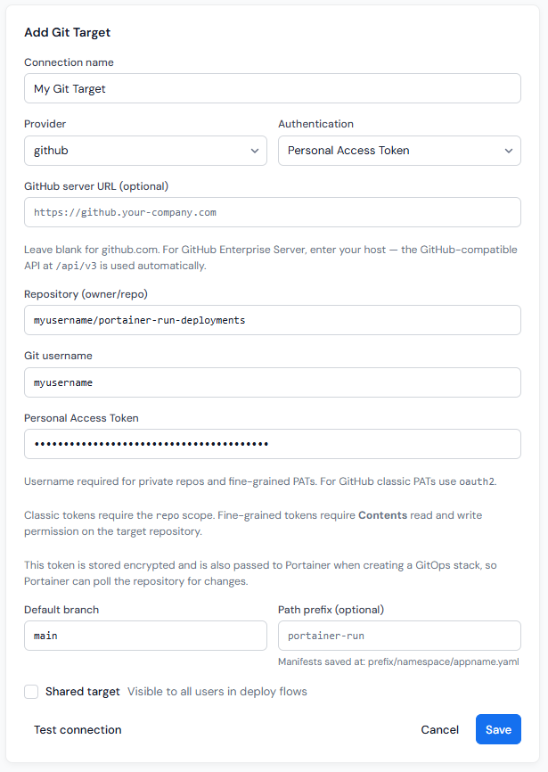

# Git Targets

[Deploy](../deploy.md) in Portainer-Run commits manifests and, for file uploads, source files, to a Git repository. A **Git target** is a stored, encrypted connection to one of those repositories.

## Personal vs. shared targets

Git targets are per-user by default: each user's targets are only visible to themselves. Administrators can additionally mark a target as **shared**, making it available to all users in every deploy flow while remaining read-only for non-admins. Non-admins can select and use a shared target, and run its Test check, but can't edit or delete it. Admins can edit and delete any target, including shared ones.

The Session section of the navigation shows the logged-in Portainer username, with an "admin" badge for admin users, so it's always clear whose targets are personal and who can manage shared ones.

## Configuring a target

Each target stores:

* **Provider**: GitHub, GitLab, Gitea, or Other, and an optional server URL.
* **Authentication** method - Personal Access Token or SSH Key.
* **Repository**, in `owner/repo` form.
* **Git username** and **Personal Access Token** or **SSH private key** (depending on your choice of **Authentication**), encrypted at rest using the encryption key provided during initial configuration. This key must remain identical across every Portainer-Run deploy, or stored targets become unreadable.
* A **default branch**.
* An optional **path prefix**.
* Whether the GIt target is a **Shared target** (ie, available to other Portainer-Run users or just the user that created it).

<figure><figcaption></figcaption></figure>

### Token scopes

<table><thead><tr><th width="253">Provider</th><th>Requirement</th></tr></thead><tbody><tr><td>GitHub (fine-grained PAT)</td><td>Contents (read and write) permission on the target repository.</td></tr><tr><td>GitHub (classic PAT)</td><td><code>repo</code> scope.</td></tr><tr><td>GitLab / Gitea</td><td>An access token with equivalent read/write repository permissions.</td></tr></tbody></table>

### GitHub Enterprise Server

Keep the provider set to **GitHub** and enter your server host in the GitHub server URL field. Portainer-Run uses the GitHub-compatible REST API at `/api/v3` on that host. Don't use the **Other** provider for GitHub Enterprise; that path targets the Gitea API instead and won't work.

### Self-hosted GitLab

Keep the provider set to **GitLab** and enter your server host in the GitLab server URL field. Leave it blank for gitlab.com.

## Testing a target

The **Test** button on each target checks connectivity and reports read and write permissions. For GitHub, this uses the collaborator permissions API, which works correctly with fine-grained PATs.

## Where things land in the repository

Regardless of which deploy path is used, Portainer-Run keeps a consistent structure so deployments across environments and namespaces stay cleanly separated within the same repository:

* Manifests: `<env-name>/<namespace>/<appname>.yaml`
* Source files: `<env-name>/<namespace>/<appname>/src/`

## Deleting an application

When an application is removed, its directory is deleted from the repository in a single commit:

* **GitHub** uses the Git Data API tree approach, removing all files under a directory in one commit regardless of file count, matching what the GitHub UI's "Delete directory" button does.
* **GitLab** uses a batch delete via the commits API.
* **Gitea** implements the equivalent behavior.

## Next: Cluster Readiness

Git Targets sits alongside [Cluster Readiness](cluster-readiness.md) in the Admin section. One governs where deployments are committed, and the other governs which environments can receive them at all.
