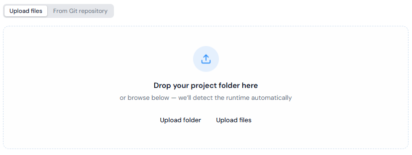
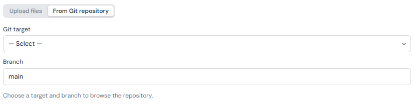

# Deploy

Deploy is how applications get onto Kubernetes in Portainer-Run. Drop in the files Claude, Cursor, or any other AI coding tool generated, and Portainer-Run handles runtime detection, dependency installation, Git commit, and Kubernetes deployment automatically. No Dockerfile, no CI pipeline, no container registry, and no platform engineering ticket.

## Two ways to provide source

**File upload**: upload or drag in the files your AI tool produced. Portainer-Run commits those files to your configured Git target before deploying.

<figure><figcaption></figcaption></figure>

**Existing Git repository**: instead of uploading files, select a configured [Git target](admin/git-targets.md), branch, and optional subfolder. Portainer-Run fetches the file listing from that repository, detects the runtime, and clones directly from the source repository on every pod start. In this mode, no source files are additionally committed to the manifests repository; only the manifest itself is.

<figure><figcaption></figcaption></figure>

## Runtime detection

The runtime is detected from the file structure. Detection runs in priority order; the first match wins.

| Signal                                                     | Runtime               |
| ---------------------------------------------------------- | --------------------- |
| `package.json` present                                     | Node.js 22            |
| `requirements.txt` present, or any `.py` file              | Python 3.12           |
| `Gemfile` present, or any `.rb` file                       | Ruby 3.3              |
| Any `.php` file                                            | PHP 8.3 (Apache)      |
| All files are static assets (HTML, CSS, JS, images, fonts) | nginx                 |
| No match                                                   | nginx (safe fallback) |

If your uploaded files include a `.env.example`, Portainer-Run detects it and presents an editable list of keys before deploying. Keys matching common secret patterns (`SECRET`, `TOKEN`, `KEY`, `PASSWORD`) are masked in the form.

## What happens on deploy

Three init containers run in sequence before the application starts, each conditional on what's needed:

1. **vibe-sync**: always present. Clones the source files from Git into a PersistentVolume.
2. **vibe-install**: present for Node.js, Python, Ruby, and PHP. Runs the runtime's dependency installer (`npm install`, `pip install`, `bundle install`, or `composer install`) against the PVC. Skipped entirely for nginx and static deployments.
3. **vibe-env**: present only when environment variables are configured. Writes a `.env` file to the PVC so the application works whether or not it uses a dotenv library itself.

None of this requires a build step. Once the init containers finish, the main application container starts against the pre-populated PVC using a stock public runtime image, with a default resource request of 0.1 CPU / 1 GB memory and a limit of 1 CPU / 4 GB memory applied automatically. See [Applications](applications.md) for how to adjust this afterward.

The manifest and (for file-upload deployments) the source files are committed to your Git target, and Portainer reconciles the change onto the cluster the same way it does for every deployment. See [Architecture](../architecture/) for the full flow, and [Git Targets](admin/git-targets.md) for where things land in the repository.

## Updating a deployed app

Any update follows the same path as the initial deploy, and is also available directly from an application's **Edit** tab via **Upload updated files**: select a folder or files and click **Commit & Restart** to commit the change to Git and redeploy. Alternatively, push new commits to the source repository directly if you're using Git-source mode; Portainer's GitOps engine picks up the change on its next reconciliation pass. The PersistentVolume retains its state across pod restarts, so anything the application wrote to disk, including uploaded files and user data, persists through the update. See [Applications](applications.md) for the full Edit tab reference.

## Current limitations

* **Single-container only.** There's no support for multi-service architectures such as sidecars, databases, or message queues.
* **No compiled languages.** Go, Java, Rust, .NET, and anything else requiring a build step before running are out of scope. The init containers install runtime dependencies; they don't compile source code.
* **An Ingress controller is required** for Ingress exposure to actually work. Portainer-Run can create the Ingress resource regardless, but it doesn't install or configure a controller.
* **A default StorageClass is required.** Deploy creates a PVC for every application to hold source files and state. Without a default StorageClass, the PVC stays unbound and the application won't start.

### Deploying without the UI: MCP

Everything Deploy does in the browser is also available through Portainer-Run's [MCP endpoint](mcp.md), so an AI coding tool can deploy an application it just generated without a human ever opening Portainer-Run at all.
