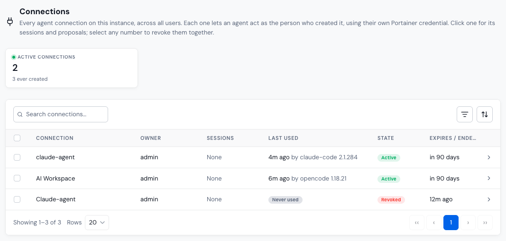
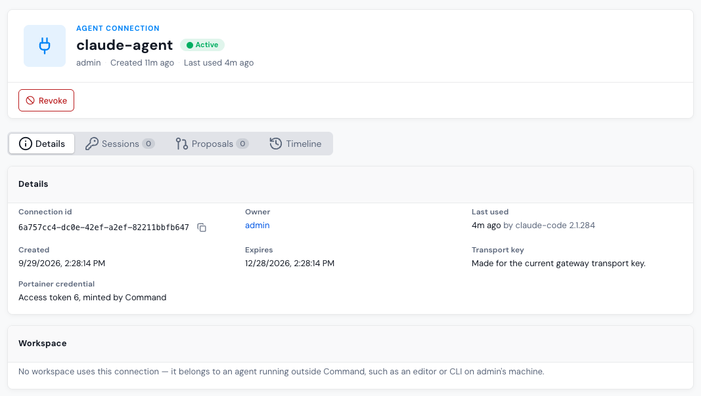

# Connections

**Connections** lists every agent connection on the instance, across all users. Each connection lets an agent act as the person who created it, using their own Portainer credential. Users create and manage their own connections on [Connect your agent](../user/connect-your-agent.md).

## View connections

The summary cards show the number of **Active connections**, and how many active connections have **no expiry**. Click a card to filter the table.

The table shows each connection's **Owner**, its **Sessions** (active and total), when it was **Last used**, its **State**, and when it **Expires / ended**. Use the search box, the state filter, and the sort menu to narrow the list.

A **Cleanup pending** state means the connection has ended, but Portainer-Command is still taking back what it held. Portainer-Command keeps retrying until it's done.

<figure><figcaption></figcaption></figure>

## Connection details

Click a connection to see:

* **Details**: its ID, owner, creation and expiry times, and the Portainer access token it uses.
* **Sessions**: every read-only session it has held.
* **Proposals**: every proposal it has opened.
* **Timeline**: its activity.

If an AI Workspace uses the connection, you can open the workspace or read its conversation. Otherwise, the connection belongs to an agent running outside Portainer-Command, such as an editor or CLI.

Once a connection has ended, a **Teardown** card shows what was cleaned up: its sessions, its Portainer access token, and its workspace.

<figure><figcaption></figcaption></figure>

## Revoke connections

Click **Revoke** on a connection's page, or select several connections in the table and click **Revoke**. Then confirm with **Revoke connection**.

Revoking a connection:

1. Stops the agent from authenticating immediately. It can't be reconnected; its owner would have to create a new connection.
2. Ends its sessions.
3. Deletes the Portainer access token Portainer-Command created for it.
4. Destroys a workspace running on it.

Progress is shown step by step. If something doesn't finish, Portainer-Command retries the remaining steps itself.

To revoke everything one person holds at once, use [Emergency halt](users.md#emergency-halt) on their user page.
