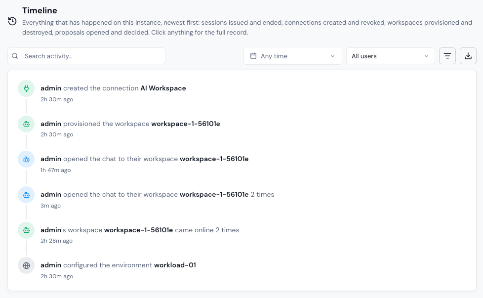

# Timeline

**Timeline** shows everything that has happened on the instance, newest first: sessions issued and ended, connections created and revoked, workspaces provisioned and destroyed, proposals opened and decided, and environment configuration changes. It's the first page under **Administration**, because it answers the question you usually arrive with: what happened?

Click any event for its full record.

<figure><figcaption></figcaption></figure>

## Filter the timeline

| Filter          | Overview                                                                                                              |
| --------------- | --------------------------------------------------------------------------------------------------------------------- |
| Search activity | Free-text search across events.                                                                                       |
| Date range      | Limits events to a range of days, in your local time zone. Defaults to **Any time**.                                  |
| User            | Shows events for one user.                                                                                            |
| Kind            | Shows one kind of activity: **Sessions**, **Connections**, **Workspaces**, **Proposals**, or **Environment changes**. |

Click **Show older** at the bottom of the feed to load more events.

## Export the timeline

Click the download icon (**Download as CSV**) to export every event that matches the current filters. This is useful for incident reviews or for handing activity records to a security team.
