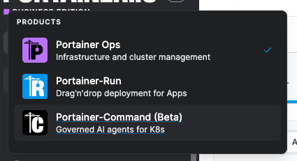

# Install

Portainer-Command is installed from the Portainer add-ons catalog, as an add-on to your Portainer Business installation.


Ensure you meet the [requirements](requirements.md) before installing.




### Install from the add-ons catalog

As a Portainer administrator, open the add-ons catalog in Portainer and install **Portainer-Command**. For the general add-on install flow, see [Add-ons](https://docs.portainer.io/admin/add-ons) in the Portainer documentation.

There are no install-time options to set. Everything is configured in Portainer-Command after it's installed.



### Wait for the installation to complete

The add-on installs into its own namespace, `portainer-addon-portainer-command`, which Portainer marks as a system namespace. It contains:

* The Portainer-Command server, reachable only through Portainer's add-on gateway.
* A PostgreSQL database with an 8 GiB persistent volume, and a NetworkPolicy that only lets Portainer-Command connect to it.
* A generated encryption key for the credentials Portainer-Command stores, and a generated database password. Both are kept across upgrades.

Portainer also places a machine credential in the namespace, which Portainer-Command uses to read its own settings from Portainer.



### Open Portainer-Command

Once the installation is complete, click the switcher icon .png>) in the top left of Portainer, and choose **Portainer-Command**.

<figure><figcaption></figcaption></figure>

Portainer-Command uses Portainer's authentication, so you're signed in as your Portainer user. Portainer administrators see the **Administration** section in the sidebar.



### Configure Portainer-Command

Before anybody can connect an agent, an administrator needs to complete a few settings. Continue to [Initial configuration](initial-configuration.md).



## Upgrading and uninstalling

Upgrade Portainer-Command from the add-ons catalog. The encryption key and database password carry forward across upgrades, so stored credentials stay readable.

When you uninstall the add-on, its namespace, encryption key, and database volume are left in place, so history survives a reinstall.


Portainer issues the add-on a new machine credential on every install, upgrade, or repair. If Portainer-Command reports that Portainer refused its credential, repair the add-on in Portainer.

