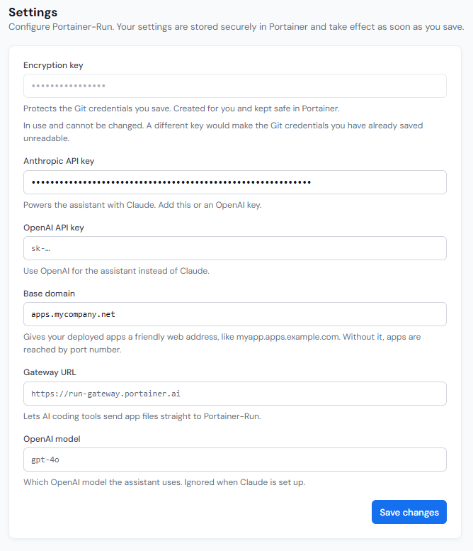

# Settings

This section contains the Portainer-Run configuration settings, and is only available to administrators.

The following options are available:

| Field/Option      | Overview                                                                                                                                                                                |
| ----------------- | --------------------------------------------------------------------------------------------------------------------------------------------------------------------------------------- |
| Encryption key    | The encryption key that was added during initial setup of Portainer-Run, used to encrypt credentials used by Portainer-Run. This cannot be changed.                                     |
| Anthropic API key | An Anthropic API key for use with the [Assistant](../assistant.md) functionality. Either this or the OpenAI API key option must be set to enable the Assistant.                         |
| OpenAI API key    | An OpenAI API key for use with the [Assistant](../assistant.md) functionality. Either this or the Anthropic API key option must be set to enable the Assistant.                         |
| Base domain       | The base domain to apply to applications deployed in Portainer-Run.                                                                                                                     |
| Gateway URL       | The URL to the Portainer-Run gateway. This gateway lets AI coding tools send application files directly to Portainer-Run, avoiding file size limitations that may otherwise be applied. |
| OpenAI model      | Specifies the OpenAI model to use when using OpenAI for the [Assistant](../assistant.md). This field is ignored when using Anthropic as the AI provider.                                |

<figure><figcaption></figcaption></figure>

