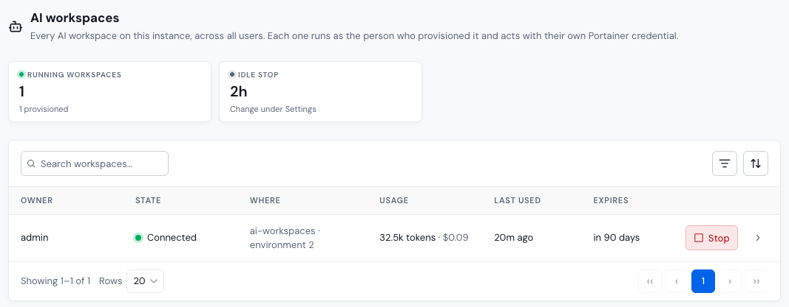

# Workspaces

**Workspaces** lists every [AI Workspace](../workspace/workspace.md) on the instance, across all users. Each workspace runs as the person who provisioned it and acts with their own Portainer credential.

## View workspaces

The summary cards show the number of **Running workspaces**, how many are **Not connected**, and the **Idle stop** time. Click **Idle stop** to change it in [Settings](settings.md#ai-workspace-details).

The table shows each workspace's **Owner**, **State**, **Where** it runs (namespace and environment), its **Usage** (tokens and cost), when it was **Last used**, and when it **Expires**. Use the search box, the state filter, and the sort menu to narrow the list.

| State             | Meaning                                                                                                  |
| ----------------- | -------------------------------------------------------------------------------------------------------- |
| Starting          | The pod is being created, or OpenCode is starting inside it.                                             |
| Connected         | The workspace is running and connected to Portainer-Command.                                             |
| Stopped           | The pod is stopped, usually after the idle timeout. Its owner can start it again.                        |
| Crashing          | The pod keeps failing. Check the pod in Portainer.                                                       |
| Image pull failed | The workspace image couldn't be pulled. Check the image in [Settings](settings.md#ai-workspace-details). |
| Expired           | The workspace reached the end of its 90-day lifetime.                                                    |
| Destroyed         | The workspace was destroyed. Its record and transcript remain.                                           |

<figure><figcaption></figcaption></figure>

Click a workspace to open it.

## Stop a workspace

Click **Stop** on a workspace, then **Stop workspace**. The pod stops and no longer consumes resources. The workspace keeps its identity, credential, and chat history, and its owner can start it again from their **Workspace** page.

Starting and destroying workspaces are left to their owners. To cut a person's workspace off completely, revoke its connection on [Connections](connections.md), or use [Emergency halt](users.md#emergency-halt) on the user.
