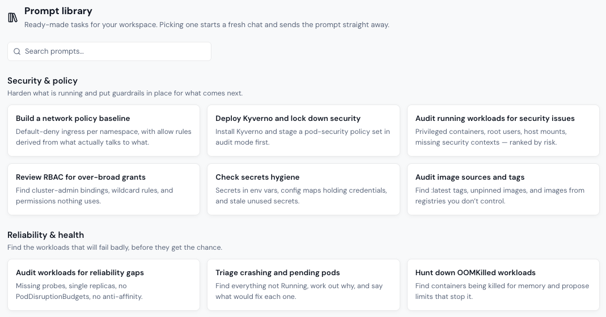

# Prompt library

The **Prompt library** holds ready-made tasks for your [AI Workspace](workspace.md). Find it under **Workspace** in the sidebar.

To use a prompt, click its card. Portainer-Command opens your workspace chat, starts a fresh conversation, and sends the prompt straight away. Every prompt starts by listing your environments and asking which one to work on. If your workspace is paused, the prompt waits until you start it.

Use **Search prompts…** to filter by title or description.

Every prompt runs through the same rules as any other request. The agent reads with a scoped, read-only credential, and anything it wants to change becomes a [proposal](../proposals.md) for a person to approve.

## Security and policy

Harden what's running, and put guardrails in place for what comes next.

| Prompt                                      | What it does                                                                                   |
| ------------------------------------------- | ---------------------------------------------------------------------------------------------- |
| Build a network policy baseline             | Default-deny ingress per namespace, with allow rules derived from what actually talks to what. |
| Deploy Kyverno and lock down security       | Installs Kyverno and stages a pod-security policy set in audit mode first.                     |
| Audit running workloads for security issues | Privileged containers, root users, host mounts, and missing security contexts, ranked by risk. |
| Review RBAC for over-broad grants           | Finds cluster-admin bindings, wildcard rules, and permissions nothing uses.                    |
| Check secrets hygiene                       | Secrets in environment variables, config maps holding credentials, and stale unused Secrets.   |
| Audit image sources and tags                | Finds `:latest` tags, unpinned images, and images from registries you don't control.           |

## Reliability and health

Find the workloads that will fail badly, before they get the chance.

| Prompt                                         | What it does                                                                       |
| ---------------------------------------------- | ---------------------------------------------------------------------------------- |
| Audit workloads for reliability gaps           | Missing probes, single replicas, no PodDisruptionBudgets, and no anti-affinity.    |
| Triage crashing and pending pods               | Finds everything not running, works out why, and says what would fix each one.     |
| Hunt down OOMKilled workloads                  | Finds containers being killed for memory, and proposes limits that stop it.        |
| Add PodDisruptionBudgets where they're missing | Protects multi-replica services from voluntary disruption taking them all at once. |
| Review node capacity and pressure              | How full the nodes are, what's overcommitted, and what fails first if one dies.    |

## Cost and efficiency

Right-size requests, and reclaim what nothing is using.

| Prompt                                           | What it does                                                                          |
| ------------------------------------------------ | ------------------------------------------------------------------------------------- |
| Tune resource requests against real usage        | Compares requests to actual consumption, and proposes corrections in both directions. |
| Find workloads with no requests or limits at all | Unbounded pods distort scheduling and get evicted first.                              |
| Find idle and abandoned workloads                | Zero-traffic services, scaled-but-unused deployments, and forgotten experiments.      |
| Review persistent volume usage                   | Oversized volumes, orphaned claims, and storage classes doing the wrong job.          |

## Networking and exposure

Control what can talk to what, and what the world can reach.

| Prompt                                     | What it does                                                                      |
| ------------------------------------------ | --------------------------------------------------------------------------------- |
| Map everything exposed outside the cluster | Every LoadBalancer, NodePort, and Ingress, and whether it should be reachable.    |
| Audit Ingress TLS and routing              | Expired-certificate risk, missing TLS blocks, duplicate hosts, and dead backends. |
| Check cross-namespace traffic flows        | Which namespaces talk to which, before you segment them.                          |

## Operations and housekeeping

Audits, upgrades, and cleanups that keep an estate honest.

| Prompt                                         | What it does                                                                |
| ---------------------------------------------- | --------------------------------------------------------------------------- |
| Check live state against the git repository    | What's running that Git doesn't describe, and what changed out of band.     |
| Find deprecated API versions before an upgrade | API versions the next Kubernetes release drops.                             |
| Namespace hygiene sweep                        | Missing quotas and limit ranges, unlabeled namespaces, and leftover debris. |
| Snapshot an environment's health               | One readable status report.                                                 |
| Audit what would survive a cluster loss        | Which state lives only in the cluster.                                      |

<figure><figcaption></figcaption></figure>
