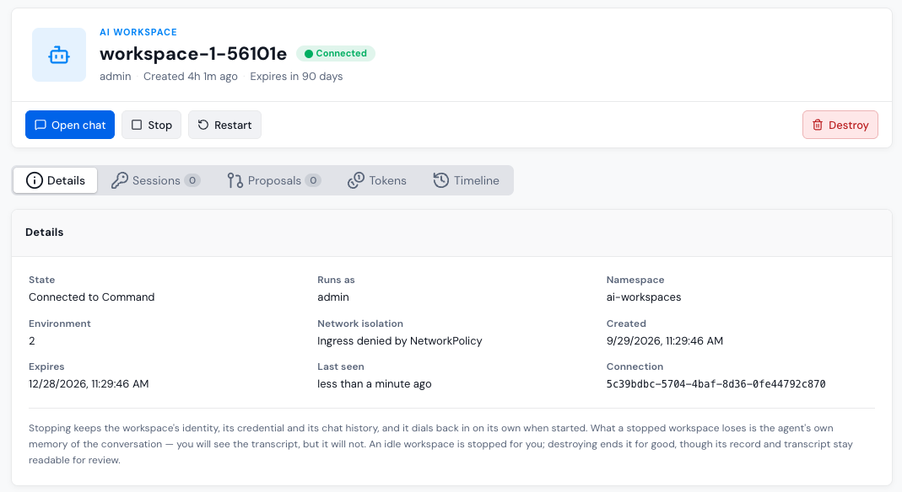

# AI Workspace

An AI Workspace is your own private, hosted agent: an OpenCode instance that Portainer-Command runs for you as a pod in your organization's cluster, with a chat page to talk to it. There's nothing to install. It already has Portainer-Command's [tools](../../architecture/mcp.md), plus `kubectl`, `helm`, and `git`.

A workspace acts as you. It sees the environments you can see, and everything it proposes is attributed to you, exactly like an agent you [connect yourself](../connect-your-agent.md).


**Workspace** only appears in the sidebar when an administrator has enabled AI Workspaces. See [Settings](../admin/settings.md#ai-workspaces).


## Provision your workspace

1. In the sidebar, click **Workspace**, then **Manage**.
2. If Portainer needs your password to create the access token your workspace acts with, enter it in **Your Portainer password**. It goes straight to Portainer and is never sent to Portainer-Command.
3. Click **Provision my workspace**.

The workspace pod starts and connects back to Portainer-Command on its own. Nothing connects in to it. Its status moves from **Starting** to **Connected** once it's ready, and **Chat** appears in the sidebar.

Provisioning creates a Portainer access token named `AI Workspace` and an agent connection for the workspace. You still need to [connect to GitHub](../connect-to-github.md) for your workspace to propose changes.

## Chat with your workspace

Click **Chat**, or **Open chat** on the **Manage** view. Type into **Message your workspace…** and send. You can ask it to do things such as list your environments, investigate a failing workload, or propose a change.

While it works, you'll see its reasoning and the tools it calls. Click **Stop** to abort the current task.

When the workspace proposes a change, an approval card appears in the chat. If you can decide the proposal, you can approve it right there. The workspace is then told the proposal was merged, and asked to check that the change rolled out. See [Proposals](../proposals.md).

For ready-made tasks, use the [Prompt library](prompt-library.md).

To start over, click **Clear chat** in the sidebar. This ends the current conversation and empties the transcript. The transcript is hidden from you but not erased, so administrators can still review it.

## Manage your workspace

The **Manage** view shows your workspace's state, where it runs, when it was last seen, and when it expires. Tabs show its **Sessions**, **Proposals**, **Tokens** (model usage and cost), and **Timeline**.

| Action  | What it does                                                                                                                                                                                                                |
| ------- | --------------------------------------------------------------------------------------------------------------------------------------------------------------------------------------------------------------------------- |
| Stop    | Stops the pod. The workspace keeps its identity, credential, and chat history, and connects back in on its own when started. The agent loses its own memory of the conversation, although you can still see the transcript. |
| Start   | Starts a stopped workspace.                                                                                                                                                                                                 |
| Restart | Restarts the workspace pod.                                                                                                                                                                                                 |
| Destroy | Ends the workspace for good. There's no confirmation. Its record and transcript stay readable for review, and you can provision a new one.                                                                                  |

<figure><figcaption></figcaption></figure>

### Idle workspaces

A workspace nobody has used for a while is stopped for you. By default, this happens after 120 minutes, but administrators can change it. When you next open the chat, you'll see **Your workspace is paused**. Click **Start workspace**, and the chat comes back as soon as it reconnects. Sending a prompt or opening the chat resets the idle clock.

### Expiry

A workspace expires 90 days after it's provisioned. An expired workspace can't start again, but its record, transcript, and usage stay readable. Destroy it and provision a new one to continue.

A workspace also stops working if its connection is revoked, for example by an administrator or an emergency halt. Destroy it and provision a new one.

## Settings that affect your workspace

Administrators choose the model your workspace uses, its CPU and memory limits, and what it can reach on the network. With the default network mode, a workspace can only reach an allowlist of domains, such as GitHub and common container registries. If your workspace can't download something it needs, ask an administrator. See [Workspace Network](../admin/settings.md#workspace-network).
