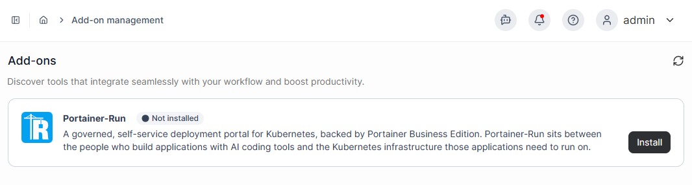
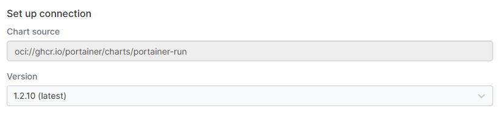
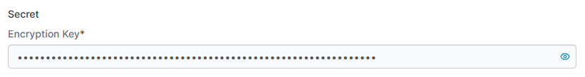
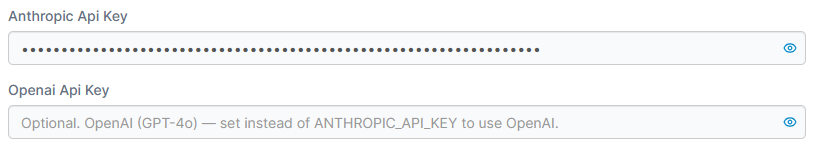
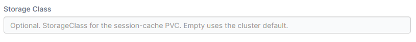
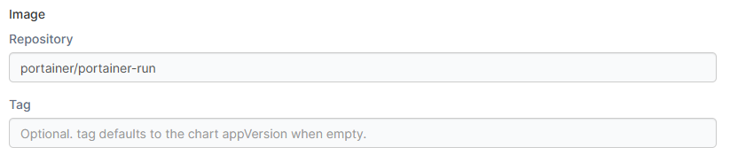
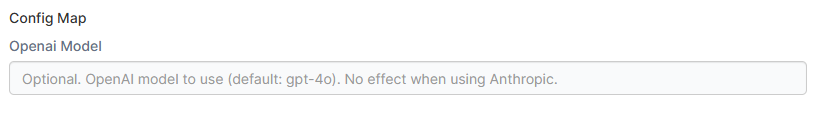
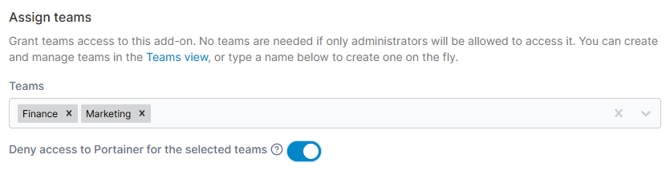
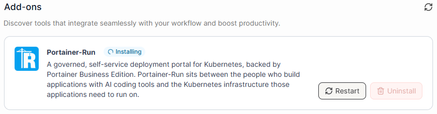
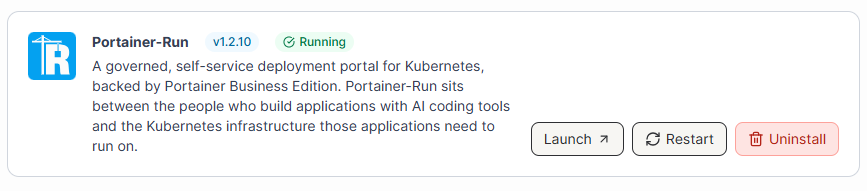

# Quick Start

Portainer-Run is installed as an add-on within Portainer Business Edition. Once you have confirmed you meet the [requirements](requirements.md) for install, these are the steps to follow.



### Log into Portainer as an adminstrator

Add-ons can only be enabled by an administrator user.



### Install the Portainer-Run add-on

Within Portainer, scroll to the Administration section in the left menu and click Add-ons.

Here you will see a list of the available add-ons. We want to install Portainer-Run, so find Portainer-Run in the list and click Install.

<figure><figcaption></figcaption></figure>



### Configure the add-on

You will be taken to the Set up Portainer-Run page where you can configure Portainer-Run.&#x20;

The Chart source and Version should be pre-selected - we recommend sticking with the latest version in most cases.

<figure><figcaption></figcaption></figure>

An Encryption Key will also be pre-generated for you. You can change this if you want.

<figure><figcaption></figcaption></figure>

If you want to use the Assistant functionality within Portainer-Run, provide either an Anthropic API Key or an OpenAI API Key in the relevant field. If neither value is set, the Assistant feature will not be available in Portainer-Run.

<figure><figcaption></figcaption></figure>

You can optionally define a Storage Class to use for Portainer-Run's session cache. You can leave this blank to use the cluster's default StorageClass.

<figure><figcaption></figcaption></figure>

Under Image you can specify the repository and tag of the Portainer-Run image to use. In most cases you won't need to change this.

<figure><figcaption></figcaption></figure>

In Config Map you can change the OpenAI model if you are using OpenAI for the Assistant. This field has no effect if you are using Anthropic.

<figure><figcaption></figcaption></figure>

When you're ready to proceed, click the Next button.



### Assign access to Portainer-Run

Portainer-Run lets you configure which teams have access to it. If you want to permit only administrators to access Portainer-Run you do not need to configure teams here. Otherwise, select the teams you want to provide access to from the dropdown.

<figure><figcaption></figcaption></figure>

If you want to prevent access to Portainer for the selected teams, toggle on the Deny access to Portainer for the selected teams option. If this is enabled, when a user within the specified teams logs into Portainer they will be sent to Portainer-Run, and will not be able to access Portainer itself.

When you're ready, click the Install button.



### Wait for the install to complete

The installation is now underway. A namespace for Portainer-Run will be created, the image pulled, and the add-on will be deployed.

<figure><figcaption></figcaption></figure>

Once the install has completed, the status will change to Running and the currently deployed version will be shown.

<figure><figcaption></figcaption></figure>



### Access Portainer-Run

Now that the install is complete you can access Portainer-Run from within Portainer by clicking the switcher icon    in the top left. This will show a dropdown list of the different products available to you, including Portainer-Run.

<figure><figcaption></figcaption></figure>

Click on the Portainer-Run option to access the Portainer-Run UI.



### You're done!

You have now installed Portainer-Run on your cluster. Enjoy!

<figure><figcaption></figcaption></figure>



## What's next

* [Requirements](requirements.md): if you skipped ahead, check you have everything in place.
* [Initial configuration](initial-configuration.md): to get Portainer and Portainer-Run configured for optimal usage.
* [Using Portainer-Run](https://app.gitbook.com/s/wg4JrAPgL0W0wygwwbaI/user): a full tour of the interface once you're up and running.
